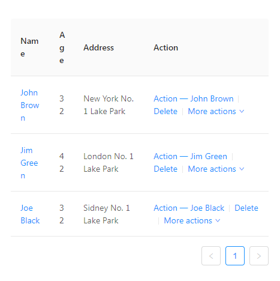

#  Что мы знаем об Ant Design


Сложно представить себе web-приложение на React без библиотеки компонентов. Вы либо постепенно пополняете такую библиотеку сами по мере необходимости, либо используете сборную солянку из готовых решений, бережно отобранных по количеству звезд в безбрежном океане npm-пакетов.

Если повезет, на момент старта проекта у вас уже будет готовая к использованию дизайн-система с React-компонентами, согласованная с дизайнерами и опробованная на боевых проектах. Но что делать, если ни дизайна, ни дизайнеров, ни тем более дизайн-системы на проекте нет и не планируется? Что, если MVP-версия приложения должна быть готова уже вчера, и времени на то, чтобы стилистически увязать написанный вами дейтпикер с тем селект-боксом с гитхаба, уже не остается? Как правило, в таких случаях перед стартом проекта делают выбор в пользу использования готовых библиотек компонентов, чтобы минимизировать затраты времени на написание собственных велосипедов.

Учитывая популярность React, его компонентный подход и дикий хайп последних лет вокруг дизайн-систем, выбор таких библиотек должен поражать воображение. Так думали мы, когда пару лет назад взялись за поиск подобной системы. На деле все оказалось не так солнечно. Библиотеки компонентов, подходящие под наши нужды, можно пересчитать по пальцам. Мы выбрали Ant Design, и с тех пор ни разу не пожалели об этом, реализовав с помощью этой библиотеки около шести проектов.

## Ant Design


Строго говоря, Ant Design - это полноценная дизайн-система, визуальный язык. Со своими принципами, стайлгайдами и библиотекой компонентов, о которой и пойдет речь в этой статье. Проект поддерживается разработчиками из Alibaba Group. Те же люди поддерживают и dva - фреймворк на основе популярного стека React, Redux, React-Router, активно использующийся в проектах Alibaba. Этим объясняется тесная интеграция обоих проектов и обилие китайского языка в документации и issue на гитхабе. Сам Ant Design написан на TypeScript, стилизован с помощью Less и портирован на Angular и Vue, однако поддерживаются порты уже совсем другими людьми.

Не будем описывать принципы Ant Design как дизайн системы, или особенности работы с dva, все это темы для отдельных статей. Сконцентрируемся на том, что может предложить Ant Design именно в качестве библиотеки компонентов для React.

## Чем хорош Ant Design

Перечислять все компоненты мы не будем, список довольно внушительный, и лучше ознакомиться с ним на [официальном сайте](https://ant.design/components). Документация очень подробная и с большим количеством примеров. Большинство компонентов можно использовать отдельно от Ant Design, используя пакеты [react-component](http://react-component.github.io/badgeboard/), которые, внезапно, поддерживаются все теми же людьми из Alibaba.

У Ant Design, на наш взгляд, есть две фичи, которые выгодно выделяют его среди аналогичных библиотек: таблицы и формы. Обе эти фичи, по сути, не являются простыми компонентами. О них и расскажем подробнее.

## Таблицы


#### Встроенная пагинация.
По умолчанию - клиентская. Но можно без проблем написать свою. То есть реализовать серверную пагинацию не составит труда.

#### Фильтрация и сортировка.
Из коробки доступна фильтрация по выпадающему селекору с опциями. Описывать функции сортировки и фильтрации нужно собственноручно. По умолчанию таблицы не умеют фильтровать по введенной строке. Но можно написать собственный кастомный фильтр, что подробно описано в документации. Нужно признать, процесс довольно мучительный, но возможностей много.

#### Выбор строк
Если вам необходимо обеспечить выбор конкретных строк таблицы для дальнейших действий со стороны пользователя, таблицы Ant Design предоставляют для этого довольно гибкий API.

#### Вложенность
Иногда бывает необходимо сделать некоторые строки таблицы разворачиваемыми, чтобы скрыть дополнительную информацию. Таблицы Ant Design умеют это из коробки.

#### Объединение ячеек
Объединение ячеек в заголовке и в строках отличаются, но в обоих случаях нужно заранее знать какие именно ячейки необходимо объединить, и указывать их явно. Это сильно усложняет обработку динамических данных, но, в принципе, не делает ее невозможной. У нас был подобный опыт, который потребовал создания дополнительных сущностей, которые описывали признаки объединения и сообщали таблице, какие ячейки уже были объединены, а какие нет.

#### Редактируемые ячейки
API у таблиц в общем довольно гибкий и позволяет как угодно рендерить ячейки. Так что редактируемость ячеек - только частный случай хитроумного использования предоставленных возможностей, который подробно описан в документации.

#### Фиксация колонок и заголовка
Пожалуй, самая востребованная для отрисовки больших объемов данных фича. Можно фиксировать как левую, так и правую колонки, заголовок таблицы, и даже все вместе. Работает не без периодически возникаемых багов, но вполне сносно.

#### Ок, а какие есть недостатки?
Первое, о чем хочется сообщить — таблицы Ant Design по умолчанию не поддерживают виртуализацию (зато в документации подробно описано, как прикрутить виртуализацию к List при помощи react-virtualized). И дефолтный размер страницы в 5 строк стоит не просто так. Из-за огромного количества напиханного функционала, метод render в таблицах срабатывает при каждом чихе (например, при наведении на строку - это нужно для корректной работы фиксированных колонок).

Из-за всего вышеперечисленного, таблицы Ant Design плохо подходят для отрисовки большого количества строк - более сотни строк уже способны существенного просадить производительность приложения.

Второе - дефолтные стили таблиц. Видимо в китайском языке не считается зазорным использовать ```word-break: break-word;```, и в таблицах это свойство используется осознанно, но в результате даже примеры из официальной документации без ограничения максимальной ширины таблиц могут выглядеть вот так:



Проблема легко решаемая, но неприятная, когда сталкиваешься с ней впервые.

Продолжая разговор о стилях, можно отметить, что контент в ячейках имеет вертикальное выравнивание по середине, что не очень хорошо выглядит при большом количестве контента в ячейке. Все это конечно дело вкуса, но на каждом новом проекте с Ant Design мы добавляем несколько стилевых хуков, которые немного меняют внешний вид таблиц. В остальном, таблицы Ant Design - прекрасный инструмент, который имеет мало аналогов в экосистеме React. Едем дальше.

## Формы


Сам по себе компонент-контейнер Form мало что умеет: скрывать звездочки обязательных полей, менять относительное расположение лейблов и полей, вызывать хендлер onSubmit. Куда важнее HOC Form.create, который добавляет большое количество полезных методов и берет на себя контроль элементов формы, декорированных с помощью getFieldDecorator.

В созданной форме можно добавлять правила валидации одним простым объектом, синхронизировать значения полей с Redux стором, хранить дефолтные значения полей отдельно, чтобы потом применить их вызовом одного метода... Возможностей довольно много. Новички часто начинают использовать компоненты форм Ant Design отдельно, поэтому пред тем, как начинать использовать формы на проекте с установленным Ant Design, мы рекомендуем внимательно ознакомиться с разделом документации по Form - владение этим инструментом избавляет от написания большого количества велосипедов.

### Компоненты форм
Ant Design предоставляет много полезных кастомизируемых компоненов для построения форм. В основном, это ставшие уже стандартом поля, переключатели и селекторы с некоторыми отличительными особенностями. 
* Input и InputNumber - это два разных компонента
* DatePicker умеет выбирать только один день или период. Способа прикрутить к нему возможность выбора двух или более независимых дат мы не нашли.
* RangePicker не помещается на мобильных устройствах. Приходится использовать два DatePicker'а.
* TimePicker выполнен в виде трех объединенных селектов (часы, минуты, секунды), что не всем может показаться привычным.
* API компонента Upload нам показалось не слишком гибким при работе

## Кастомизация и локализация
В качестве рекомендуемого способа кастомизации предлагается перезапись Less-переменных с помощью ```less-loader```. Выглядит этот способ довольно костыльно, и предполагает хранение конфига темы в виде js-объекта. Бонусом, правда, идет возможность использования указанных в конфиге переменных во всех less-файлах сборки без дополнительных импортов.

Классический способ - подключение и перезапись стилей - тоже работает, но не рекомендуется, поскольку тянет за собой стили абсолютно всех компонентов, вне зависимости от того, используете ли вы их все, или только несколько.

Отдельно стоит сказать о том, что создать темную тему оказалось сложнее, чем мы думали. Это повлекло за собой не только переписывание большого количества переменных (а их [немало](https://github.com/ant-design/ant-design/blob/master/components/style/themes/default.less)), но и написания некоторого количества стилей уже поверх Ant Design. Со светлыми темами обычно таких проблем не возникает.

Для интернационализации Ant Design предлагает обертку ```LocaleProvider ``` и список локалей на выбор. ru_RU в списке присутствует.

## Вывод
Конечно, библиотека Ant Design не лишена недостатков. К ним относится, например, плохая адаптация к мобильным девайсам (существует [Ant Design Mobile](https://mobile.ant.design/), но это уже совсем другая история). И все же на фоне альтернатив этот проект выгодно выделяется масштабом, консистентностью, большим набором готовых решений (существует даже официальный бойлерплейт для админ-панелей - [Ant Design Pro](https://pro.ant.design/)). Мы рекомендуем использовать Ant Design для быстрого старта не слишком требовательных к веб-дизайну проектов, MVP-версий, проектов, не предполагающих широкий охват аудитории.
